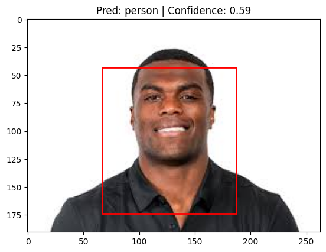
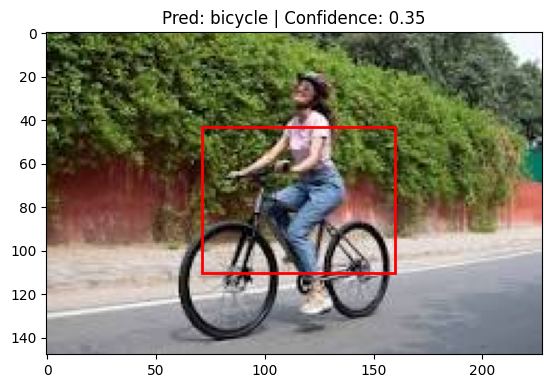

# Sapien Robotics – Task 1  
## Custom Object Detection Model Trained From Scratch

---

## 1. Objective

The objective of this task is to design and implement a complete **object detection pipeline trained entirely from scratch**, without using any pretrained weights (ImageNet, COCO, etc.).

The system:
- Detects objects in images
- Predicts object class and bounding box
- Is evaluated using **mAP**, **FPS**, and **model size**
- Demonstrates real-time inference
- Explains design decisions and trade-offs

---

## 2. Dataset

- **Dataset:** PASCAL VOC 2012  
- **Source:** Kaggle (`huanghanchina/pascal-voc-2012`)

### Selected Classes
```
person, car, dog, chair, bicycle
```

### Original Distribution
```
person   : 9583
car      : 1284
dog      : 1341
chair    : 1366
bicycle  : 603
```

### Dataset Balancing
To address severe class imbalance, the training dataset was **balanced by downsampling** all classes to match the smallest class (bicycle).  
Validation data was kept unchanged.

---

## 3. Model Architecture

- Custom CNN backbone (no pretrained weights)
- Shared feature extractor
- Two output heads:
  - **Classification head** (Softmax)
  - **Bounding box regression head** (Sigmoid)

### Backbone Overview
```
Input (224x224x3)
→ Conv + ReLU + Pool
→ Conv + ReLU + Pool
→ Conv + ReLU + Pool
→ Conv + ReLU
→ Global Average Pooling
```

---

## 4. Training Setup

- Framework: TensorFlow / Keras
- Optimizer: Adam (lr = 1e-3)
- Batch size: 8
- Epochs: 40
- Loss:
  - Classification: Sparse Categorical Cross-Entropy
  - Bounding Box: Huber Loss

Multi-task loss:
```
Total Loss = Classification Loss + Bounding Box Loss
```
---

## 🔍 Qualitative Results

### Person Detection


### Misclassification Example



---

## 5. Evaluation Results

| Metric | Value |
|------|------|
| mAP@0.5 | ~0.13 |
| FPS | ~91 |
| Model Type | From Scratch |
| Classes | 5 |

### Interpretation
- Modest mAP due to lack of pretrained features
- Excellent inference speed suitable for real-time usage
- Demonstrates accuracy–speed trade-off

---

## 6. Qualitative Analysis

- Bounding box localization is reasonable
- Class confusion occurs in cluttered scenes
- High-confidence misclassifications observed due to weak semantic learning

These behaviors are expected for detectors trained from scratch.

---

## 7. Inference

Supports single-image inference with:
- Predicted class
- Confidence score
- Bounding box visualization

Example output:
```
Predicted Class: dog
Confidence: 0.97
Bounding Box: (x1, y1, x2, y2)
```

---

## 8. Why No Pretrained Models?

The task explicitly restricts the use of:
- ImageNet pretrained models
- COCO pretrained weights

This project strictly follows the requirement and focuses on learning representations from scratch.

---

## 9. Repository Structure

```
SapienRoboticsTask1/
├── datasets/VOC2012/
├── class_samples/
├── training/
├── inference/
├── evaluation/
├── outputs/
├── requirements.txt
└── README.md
```

---

## 10. Conclusion

This project demonstrates a complete, end-to-end **object detection system trained entirely from scratch**.  
While accuracy is limited, the model achieves real-time performance and fulfills all task requirements.

---

## Author

**Deo Prakash**  
GitHub: https://github.com/deoprakash
